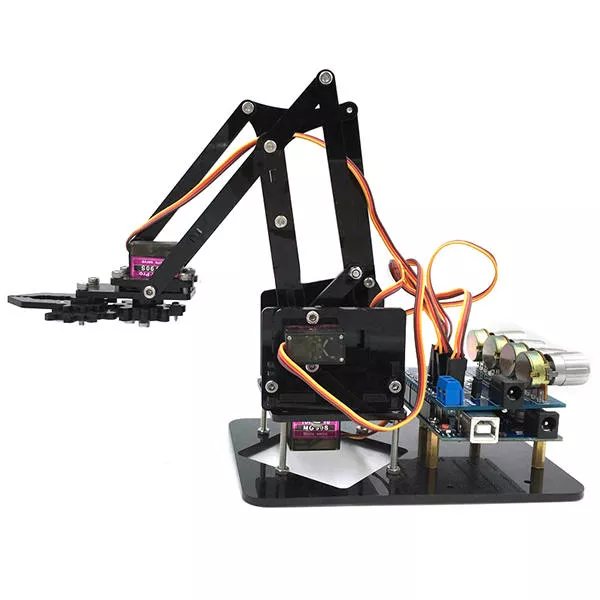
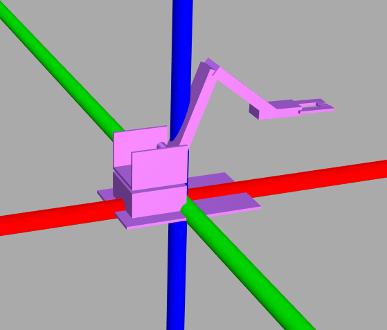

# Simple Robot Arm with ROS
simple 4DOF robot arm operated by ROS. Implements [rosserial_python](http://wiki.ros.org/rosserial_python) on the server, and [rosserial_arduino](http://wiki.ros.org/rosserial_arduino) on the Photon.
I bought this robot from Banggood:<br/><br/>



The original model has a closed loop; i simplified this to remove the closed loop and plan to manage the offset joint angles through code.<br/><br/>


# task list
- create custom message type e.g.
```
# Servoangle.msg
uint16 servo_id
uint16 target_angle
```
- report current servo angles via joint state publisher
- report when requested angle is outside min/max range for servo
- build URDF for robot arm
- document wiring etc.

# Instructions
## ROS server
1. clone ros folder to catkin_ws and run `catkin_make`. Tested on Lubuntu 18.04 LTS with [Ros Melodic Morenia](http://wiki.ros.org/melodic). Remember to install Python on your ROS server too.
1. Launch `roscore`
1. Launch `rosrun rosserial_python serial_node.py tcp`
1. Publish something e.g. `rostopic pub /servo std_msgs/String 0/300` would send an instruction to set servo `0` to `300` (which is out of range).

use ` check_urdf src/simple_arm/urdf/simple_arm.xacro ` to check URDF is valid
use `roslaunch training_world training_world.launch` to launch world


## Particle Photon
1. Build particle_ros_node.ino
1. doesn't seem to work via cloud build...
1. flash to device (via cloud is ok)
1. check at [https://console.particle.io/devices](https://console.particle.io/devices) to see the status


notes:
incorporates https://github.com/wojiaojiao/pegasus_gazebo_plugins